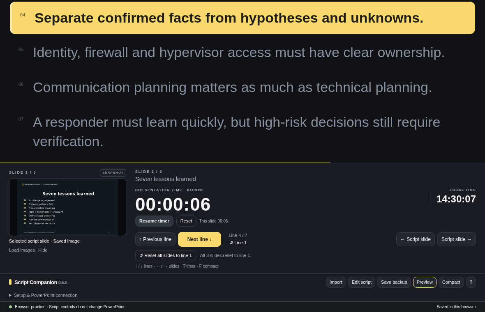
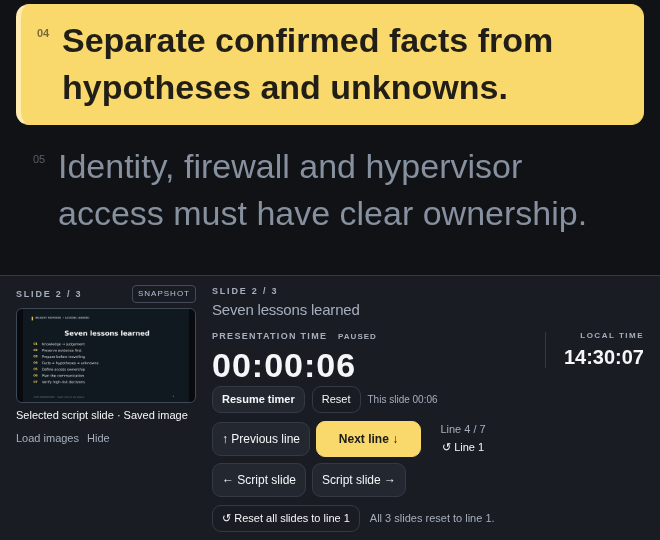
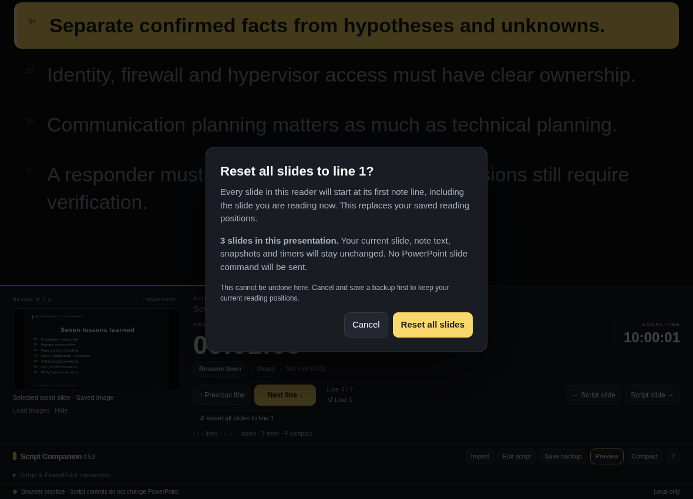

# Script Companion for Mac

### Keep your place in your notes. Keep the audience in view.

An offline, line-by-line presentation reader with a **highlighted current sentence**, **notes at the very top**, **slide snapshots**, and **presentation timing**. A small native Mac companion adds an experimental connection to PowerPoint's speaker notes and slideshow position.

**Version 0.5.3 · macOS source prototype · Standalone offline HTML reader · MIT license**



*Actual Chromium test capture using the included sample deck. Not a native Mac/PowerPoint screenshot; the test uses a controlled clock.*

> **Before using this for a live talk:** this repository contains source and a local Mac builder, **not a prebuilt, notarized app or an Office ribbon plug-in**. Browser tests and simulated connection tests are included. The native Mac build, real PowerPoint automation, keyboard delivery and projector privacy still need rehearsal testing on your setup. Keep PowerPoint's own controls available.

[Get started](#get-started) · [Keyboard controls](#keyboard-controls) · [PowerPoint setup](#connect-to-powerpoint-experimental) · [Screenshots](docs/SCREENSHOTS.md) · [Tests](docs/TESTING.md) · [Troubleshooting](docs/TROUBLESHOOTING.md)

## What it does

| Feature | Behaviour |
| --- | --- |
| **Notes first** | The highlighted line is anchored 4 CSS pixels below the reader's top edge. Slide title, snapshot and controls stay underneath. |
| **Read one thought at a time** | Up/Down moves the highlight. Reaching the last line does not advance the slide. |
| **Remember every slide** | Return to a slide and recover its highlighted line. Stable PowerPoint slide IDs are used when available. |
| **Start a new rehearsal** | Reset only this slide, or confirm **Reset all slides to line 1**. Notes, images and timers are untouched. |
| **Read PowerPoint notes** | Import a saved `.pptx` locally, or try live notes and position following in the native app. |
| **See the current slide** | Load exported PNG/JPEG slide images or a ZIP of those images. Review the mapping before applying it. Click a snapshot to enlarge. |
| **Watch your time** | Current local time, total elapsed presentation time and cumulative time on the selected slide. Pause/resume or reset timing independently. |
| **Use a smaller window** | Compact mode, adjustable text size and a native **Move reader to top** command. |
| **Keep a backup** | Local saves and export/import of JSON backups containing notes, reading positions, timing and supported image data. |

**No microphone, voice tracking, account or internet connection is needed to read.** The reader advances through your lines when you press a key or click a control; it does not listen to your speech. Build/test tools and GitHub publishing require initial downloads or network access.

## Get started

### Option A — try the reader without building anything

Download this repository using **Code → Download ZIP**, extract it, then open **`Source/reader.html`** in a browser. Open the actual downloaded file, not GitHub's source-code view.

Use **Import** to load `Demo/Preview demo.script.json` for a three-slide sample with pictures and saved reading positions. Or import your own saved `.pptx` to extract its notes and slide count. Put one sentence or speaking thought on each note line.

The standalone reader runs offline. **Its slide buttons change the local script slide only; they do not control running PowerPoint.** Browser local storage can be blocked or cleared, especially for local files. Save a JSON backup before relying on it.

### Option B — build the Mac companion

The build targets **macOS 13 or later** and the architecture of the Mac used to build it. PowerPoint for Mac must be installed for the live integration. A supported target is not a verified compatibility matrix: see the [test scope](docs/TESTING.md).

1. Extract the repository into a writable folder. Quit any previous Script Companion app and save a backup.
2. Double-click **`Build Mac App.command`**. It uses Apple's Command Line Tools; when they are missing, it requests their installation. Run the builder again after installation. The first tools download requires internet. See [Apple's installation guide](https://developer.apple.com/documentation/xcode/installing-the-command-line-tools).
3. A successful build creates **`Script Companion.app`** beside the builder. Open it and find **▤ Script** in the Mac menu bar.

For Terminal use, from the extracted repository folder:

```bash
bash "Build Mac App.command"
```

The builder does not overwrite an existing app. Build in a fresh folder when updating. It performs **ad-hoc local signing only**, not Developer ID signing or notarization. It does not require `sudo` or disabling Gatekeeper, SIP, or other protections. Inspect the source before running it; follow your organisation's software policy.

## Connect to PowerPoint (experimental)

Use your Mac display for the reader and a projector for the audience. **Use extended displays, not mirroring**, and verify the projector image yourself. The app's display-placement checks are not a guarantee that your notes remain private in every configuration.

Start the slideshow in Presenter View. In the reader's bottom **Setup & PowerPoint connection** drawer, click **Link PowerPoint** and confirm the correct presentation. This requests the macOS Automation permission used to read notes, slide count and the current slideshow position.

For the reader's slide buttons, select **Slide buttons: Set up**, grant Accessibility access when requested, and explicitly choose the slideshow/Presenter View window, **not the editing window**. Setup itself does not advance a slide. Close dialogs and avoid focusing a notes text field before testing navigation. Rebuilt apps may need their permissions reviewed.

The button adapter uses a slide number followed by Return and checks the actual slide reported by PowerPoint. It does not optimistically advance the notes or automatically resend a failed keystroke. This is intended to jump to an actual slide, **including hidden slides in full-deck order**, rather than play each animation. Custom shows are not supported. Microsoft documents the relevant [presentation keyboard shortcuts](https://support.microsoft.com/en-us/accessibility/powerpoint/use-keyboard-shortcuts-to-deliver-powerpoint-presentations); that documentation is not verification of this adapter on your Mac.

A PowerPoint connection can follow notes while slide control is unavailable. Treat a stale snapshot or a connection warning as a warning, not as a successful command. Initial linking and **Refresh notes** read the deck and can take time. Position polling uses a smaller adapter; **real end-to-end latency has not been benchmarked here**.

## Keyboard controls

### While the reader is focused

| Key / control | Action |
| --- | --- |
| **↑ / ↓** | Previous / next note line. Stops at the boundary. |
| **← / →** | Previous / next script slide. In the native app, a working link and configured slide buttons are needed to control PowerPoint. |
| **Home / End** | First / last line of the current slide. |
| **T** | Start, pause or resume the presentation timer. |
| **F** | Compact / expanded view. |
| **P** | Show / hide the slide snapshot. |
| **↺ Line 1** | Reset the current slide's reading position only. |
| **↺ Reset all slides to line 1** | Confirm a reset of every reading position; stay on the same slide. |

When an editor or modal dialog is open, normal text entry/dialog handling takes priority.

### While PowerPoint is focused

The optional native **PowerPoint keys** mode captures **Up/Down only** for script lines. PowerPoint receives Left/Right directly, so those keys can advance **animations as well as slides**. This bypasses the reader's slide-button adapter. Enable this only deliberately, after granting Accessibility permission, and turn it off before editing or using dialogs. **T is not a global timer shortcut.** Separate optional global line shortcuts are available through the native menu.

## Slide snapshots

In PowerPoint, export **PNG or JPEG → Save Every Slide**, including the images needed for your full-deck sequence. Load your notes first, then choose **Load images** in the reader. Select the complete set or its ZIP, check the slide-number mapping and confirm.

A snapshot is a saved picture, **not live screen capture, animation, video or automatic `.pptx` artwork rendering**. This branch does not include the experimental screen-capture feature from an earlier prototype. Re-export after changing slide visuals. Speaker-note imports are also snapshots unless the native live link is active; use **Refresh notes** after substantial edits or reordering.

## Clock, timer and saved positions

**Local time** is the time of day; click it to change between 12- and 24-hour display. **Presentation time** is the elapsed stopwatch. **This slide** accumulates time while that slide is selected in the reader, including repeat visits. It follows the confirmed reader position, so synchronization delays affect its attribution to a slide.

Changing slides does not reset timing. The timer's **Reset** asks for confirmation and resets timing only. Restored timers open **paused**, so closed-app time is not added. Pause before sleep, breaks or closing; sleep behaviour has not been tested. A crash may lose a few recent seconds between checkpoints.

For an accidental click, **Slide 4, line 6 → Slide 5 → Slide 4** restores line 6. The reset-all button clears those positions without moving PowerPoint, clearing notes or stopping a running timer. Save a backup before resetting; there is no dedicated undo button.

## Compact view and reset confirmation



*Actual browser test, 660 × 540 viewport. Compact mode preserves the notes-first order.*

<details>
<summary>See the reset-all confirmation</summary>



*Actual browser test dialog with sample data. Reset is explicit and can be cancelled.*

</details>

## Privacy and storage

All normal reader processing is local. The HTML bundles JSZip and does not load a CDN. The native wrapper loads bundled resources; it does not upload notes. PowerPoint notes are read, not edited. Slide control can change the running slideshow only after its explicit setup.

The native app stores state under **`~/Library/Application Support/Script Companion/`** (`state.json` and `timer.json`); the browser uses local storage. These are **not encrypted by the app**. JSON backups can include your entire script, presentation identity and slide pictures. Large images may exceed browser storage limits: read save warnings and export a backup.

**Do not commit real presentations, backups, screenshots of confidential slides, or unreviewed diagnostics.** The repository includes only a sample rehearsal deck, fixtures and demonstration screenshots—not the author's real presentation or desktop capture. The `.gitignore` helps exclude generated apps, build logs and local test output; it is not a substitute for reviewing files before publishing.

## Tests and development

No Python dependency is required to use the HTML reader or build the native Swift app. To run browser tests:

```bash
python3 -m venv .venv
source .venv/bin/activate
python -m pip install -r requirements-dev.txt
python -m playwright install chromium
python Tests/run_all.py --browser-only
```

Run `python Tests/run_all.py` to also run isolated Swift policy/parser/placement checks when a Swift toolchain is installed. Output goes to `Tests/artifacts/`. `CHROMIUM_EXECUTABLE` can point to a system Chromium; otherwise Playwright uses its installed browser.

See the **[publication test report](docs/TESTING.md)** for fresh results, exact scope, limitations and source hashes. Tests cover real reader JavaScript, imports, position memory, reset-all, clocks, timers, preview mapping, offline requests, responsive layouts, and simulated native packets. **A simulated connection is not a test of PowerPoint itself.**

The included GitHub Actions workflow runs the browser suite and uploads its results/screenshots on pushes and pull requests. It has not been run on GitHub as part of preparing this package; consult an actual workflow run after publishing rather than assuming a green badge. CI downloads its dependencies and is not an offline installation workflow.

## Repository layout

```text
Source/                    Swift wrapper, AppleScript adapters, offline reader
Build Mac App.command      Local macOS builder
Demo/                      Sample notes, three-slide deck and slide images
Tests/                     Browser tests, fixtures, isolated Swift tests
Tests/artifacts/           Fresh generated test output (ignored)
docs/screenshots/          Selected, reviewed browser test captures
docs/test-results/         Publication results and source hashes
docs/                      Testing, troubleshooting and screenshot gallery
Licenses/                  Bundled third-party license notices
.github/                   CI and issue templates
```

Contributions and reproducible bug reports are welcome. Read **[CONTRIBUTING.md](CONTRIBUTING.md)** and **[SECURITY.md](SECURITY.md)** before sharing diagnostics. No support or response-time guarantee is provided.

## License and acknowledgements

Original project code, documentation and sample materials are provided under the **[MIT License](LICENSE)**. Bundled JSZip is used under its MIT option; its dependencies retain their own notices in **[Licenses/](Licenses/)** and **[THIRD_PARTY_NOTICES.md](THIRD_PARTY_NOTICES.md)**. Their original terms are not replaced by this repository's license.

Built around a practical presentation need: keeping one's place without repeatedly searching the notes. The prototype was developed iteratively with AI assistance and needs human review and real-machine testing. This project is independent and is **not affiliated with or endorsed by Microsoft, Apple or GitHub**. PowerPoint is a Microsoft product.
