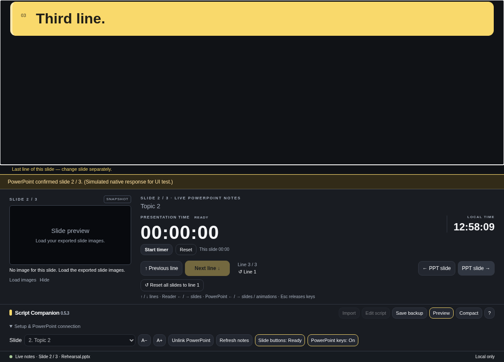

# Test screenshots

These are captures of the actual `Source/reader.html` UI rendered by Chromium tests, with sample data. They are **not** native macOS desktop captures or evidence that real PowerPoint control works. Clock/timer screenshots can use virtual test time. No real 31-slide presentation or personal desktop screenshot is included.

## Notes-first expanded layout

Generated by `Tests/test_notes_at_top.py` (1180 × 760). The current line is the first reader content; slide identity, snapshot, elapsed timer, clock and controls sit below it.

## Compact layout

Generated by the same test (660 × 540). It retains notes above the dashboard.

## Confirmed reset-all

Generated by `Tests/test_reset_all_lines.py`. This confirms resetting reading positions without changing notes, slide selection, previews or timing.

## Simulated slide-control setup

Generated by `Tests/test_slide_buttons.py`. Native messages are simulated. The screenshot tests the connection/control interface, **not keyboard delivery to PowerPoint**.

To regenerate, run the browser tests described in [TESTING.md](TESTING.md). New captures appear under `Tests/`; review them before copying selected files into this directory. Do not use production presentations for public screenshots.
